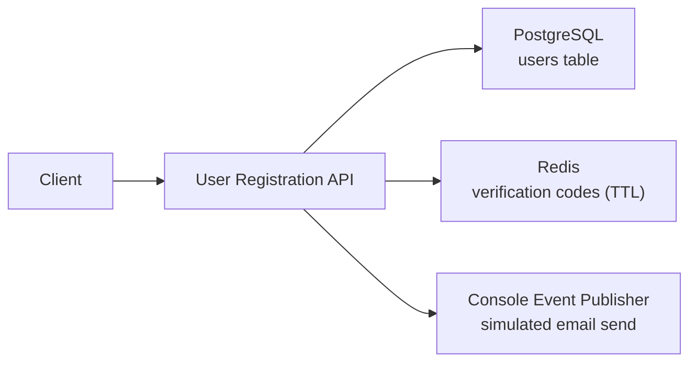
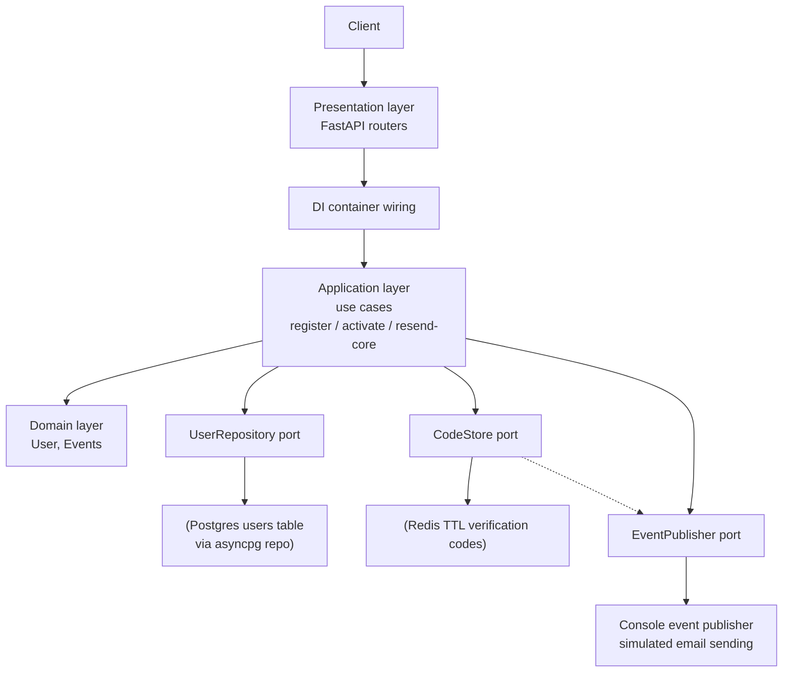

# Building a user registration API

- [Building a user registration API](#building-a-user-registration-api)
  - [Context](#context)
  - [Specifications](#specifications)
  - [Architecture](#architecture)
    - [High level architecture](#high-level-architecture)
    - [Lower level architecture](#lower-level-architecture)
  - [Layout](#layout)
  - [Usage](#usage)
    - [Install](#install)
    - [Test](#test)
    - [Run application](#run-application)

## Context

Handles user registrations. To do so, user creates an account and we send a code by email to verify the account.

As a core API developer, you are responsible for building this feature and expose it through API.

## Specifications

You have to manage a user registration and his activation.

The API must support the following use cases:

- Create a user with an email and a password.
- Send an email to the user with a 4 digits code.
- Activate this account with the 4 digits code received. For this step, we consider a `BASIC AUTH` is enough to check if he is the right user.
- The user has only one minute to use this code. After that, an error should be raised.

Design and build this API. You are completely free to propose the architecture you want.

## Architecture

### High level architecture



### Lower level architecture



## Layout

```plaintext
├── .env.example
├── scripts
│   └── init_db.sql
├── src
│   └── app
│       ├── application
│       │   ├── dto
│       │   │   └── user_dto.py
│       │   ├── exceptions.py
│       │   ├── ports
│       │   │   ├── code_store.py
│       │   │   ├── event_publisher.py
│       │   │   └── user_repository.py
│       │   └── use_cases
│       │       ├── activate_user.py
│       │       ├── register_user.py
│       │       └── resend_code.py
│       ├── config.py
│       ├── container.py
│       ├── domain
│       │   ├── entities
│       │   │   └── user.py
│       │   ├── events
│       │   │   ├── base.py
│       │   │   └── user_events.py
│       │   ├── exceptions.py
│       │   └── value_objects
│       │       ├── email.py
│       │       ├── password.py
│       │       ├── user_id.py
│       │       └── verification_code.py
│       ├── infrastructure
│       │   ├── code_store
│       │   │   ├── memory_code_store.py
│       │   │   └── redis_code_store.py
│       │   ├── database
│       │   │   ├── mappers
│       │   │   │   └── user_mapper.py
│       │   │   ├── models
│       │   │   │   └── user_model.py
│       │   │   └── repositories
│       │   │       └── postgres_user_repository.py
│       │   └── event_publisher
│       │       └── console_event_publisher.py
│       ├── main.py
│       └── presentation
│           ├── dependencies.py
│           ├── exception_handlers.py
│           ├── routers
│           │   └── v1
│           │       └── users.py
│           └── schemas
│               └── users.py
├── tests
│   ├── integration
│   │   ├── conftest.py
│   │   └── test_v1_users.py
│   └── unit
│       ├── application
│       │   └── use_cases
│       │       ├── conftest.py
│       │       ├── test_activate_user.py
│       │       ├── test_register_user.py
│       │       └── test_resend_code.py
│       ├── domain
│       │   ├── entities
│       │   │   ├── conftest.py
│       │   │   └── test_user.py
│       │   └── value_objects
│       │       ├── test_email.py
│       │       ├── test_password.py
│       │       ├── test_user_id.py
│       │       └── test_verification_code.py
│       └── fakes
│           ├── fake_code_store.py
│           ├── fake_event_publisher.py
│           └── fake_user_repository.py
```

## Usage

### Install

```bash
make install
```

### Test

```bash
# Run unit test (does not require Postgres and Redis running):
make test-unit

# Run integration test (will start Postgres and Redis via docker-compose automatically):
make test-integration

# Run full tests:
make test
```

### Run application

```bash
# Init DB: (only need to run once)
make init-db

# Create .env file from .env.example: (only need to run once)
cp .env.example .env

# Run application:
make run

# Now you can access the API docs at:
# http://localhost:8000/docs

# Stop Postgres and Redis:
make stop-docker-compose
```

> [!NOTE]
>
> - [ ] Current implementation for event publisher just prints to console, but it would be nice to use RabbitMQ, but need more time to implement it.
> - [x] SQL operations are not using transactions for simplicity, will be added later.
> - [ ] `BasicAuth` is not used yet.
> - [ ] request and response are not logged, but can be added later with middleware.
